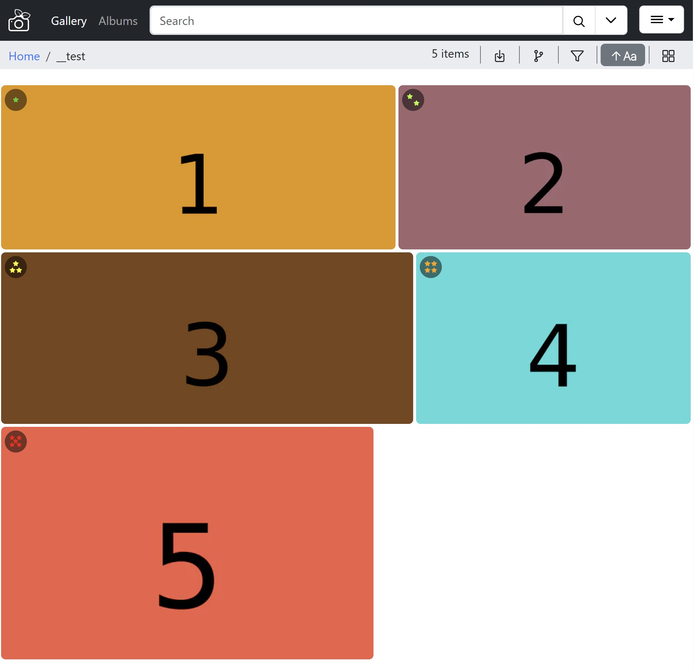

# pigallery2-grid-rating-extension

PiGallery2 Grid Rating Extension


Usage:

```
npm install
npm run build
```

for manual installation/testing: copy the result to the pigallery2 `config/extensions/pigallery2-grid-rating-extension` folder

For initial pigallery2 extension documentation, see https://github.com/bpatrik/pigallery2/tree/master/extension

------------------------------------------------------------------------

This simple extension adds stars ratings in the grid overview:


